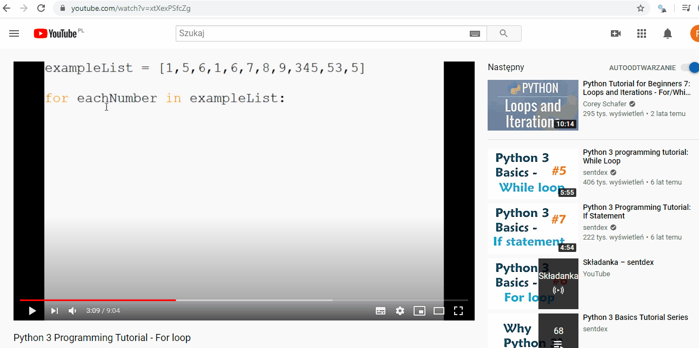

## `SnipSnap_tool`

    The SnipSnap_tool is a tool that cnoverts the selected area on the screen to text. 
    This can be especially usefull for working with pdf files, pictures that include text or extracting text from 
    video lectures.
    
    The core features were developed using the PyQt library and pytesseract. 
##'Demo'    

* Specify area, press 'enter', play around with the extracted text
* The tool also serves as a simple text editor
* Save text and/or snippet 
* Print extracted text
* Open existing text or picture files
* Tool works with multiple screens

